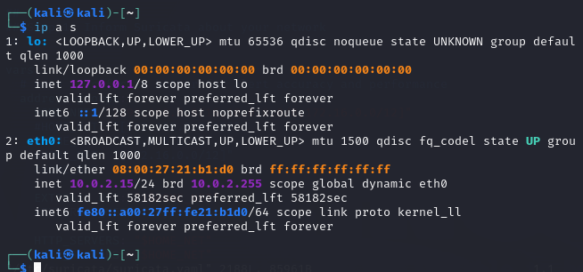
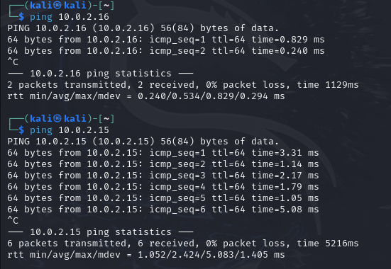
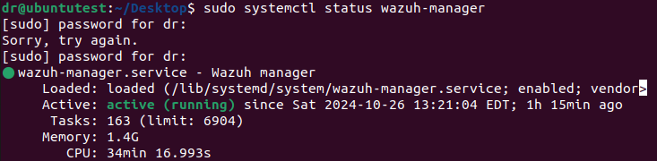
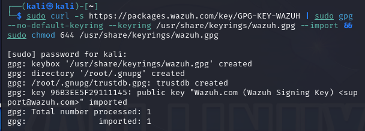

# Intrusion Detection Lab with Suricata and Wazuh Integration

<div style="text-align: center;">
    
</div>

## Overview

In this lab, I focused on implementing **Suricata**, a high-performance network threat detection engine, alongside **Wazuh** for enhanced logging and monitoring capabilities. Suricata operates as an **Intrusion Detection System (IDS)**, scanning network traffic in real-time to detect suspicious activities. On the other hand, Wazuh functions as a **Security Information and Event Management (SIEM)** tool, analyzing and visualizing logs. This setup significantly improves the security of a network environment by integrating IDS and SIEM functionalities across multiple **Virtual Machines (VMs)** for comprehensive network and system monitoring.

## Why This Lab is Important

By combining **IDS/IPS capabilities** (Suricata) with **SIEM logging and analysis** (Wazuh), this lab introduces essential cybersecurity concepts such as **threat detection**, **network traffic analysis**, and **incident response**. Understanding how to set up and configure these tools is invaluable for any security professional, as it builds proficiency in:

- **Detecting network anomalies** and potential attacks
- **Gaining visibility into network traffic patterns**
- **Correlating IDS alerts** with a SIEM for actionable insights

This lab demonstrates how to configure and deploy IDS/IPS systems and leverage SIEM integration for **holistic threat visibility**, ultimately improving the **security** and **resilience** of network environments.

---

## Lab Walkthrough

### 1. Setting Up Suricata

**Suricata** is deployed as an IDS to monitor and detect threats by analyzing network traffic.

- **Verify Suricata Installation**: Start by checking Suricata's status to confirm that it is active.

    ```bash
    sudo systemctl status suricata
    ```

    

- **Confirm Suricata Configuration Files**: Navigate to `/etc/suricata` to see the Suricata configuration files, which include `suricata.yaml` (the main config file) and the rules folder.

    ```bash
    ls -al /etc/suricata
    ```

    

    ```bash
    ls -al /etc/suricata/rules
    ```

    

- **Identify Network Interface**: Use `ifconfig` or `ip a s` to identify your network interface details (IP, subnet, etc.). This information is essential for configuring Suricata’s network settings.

    ```bash
    ifconfig
    ```

    

    ```bash
    ip a s
    ```

    

### 2. Configuring Suricata

- **Edit the Suricata Configuration File**: Modify `suricata.yaml` to specify network ranges and address groups to match your environment.

    

- **Specify Network Interface for Packet Capture**: Under the `af-packet` section, define the network interface Suricata should monitor.

    

- **Enable Flow IDs for Event Correlation**: Set `community-flow-id` to enable log import in JSON format, which allows better integration with tools like Zeek and Wazuh for event correlation.

    

- **Load Configuration and Rules**: After editing, update Suricata’s configuration and load the rules.

    ```bash
    sudo suricata -T -c /etc/suricata/suricata.yaml
    ```

    

    

### Adding Additional Sources to Suricata

Adding external sources to Suricata, such as **ET/Open**, **tgreen/hunting**, and **malsilo/win-malware**, enhances its detection capabilities by broadening the scope of threat intelligence. These sources provide up-to-date rulesets for various threat categories:

- **ET/Open**: Community-driven and constantly updated with rules to detect emerging threats.

- **tgreen/hunting**: Adds advanced detection rules for proactive threat hunting.

- **malsilo/win-malware**: Specializes in identifying malware threats, particularly those targeting Windows systems.

This integration strengthens Suricata’s ability to detect complex threats across different attack vectors, improving overall network defense.

   

### 3. Checking Log Files

- **Verify Log Output**: Suricata logs are located at `/var/log/suricata`. Check the folder to ensure logs like `eve.json`, `fast.log`, and `stats.log` are populated.

    ```bash
    ls -al /var/log/suricata
    ```

    

---

### 4. Testing Suricata Detection Capabilities

1. **Generate Test Traffic**: Use the `curl` command to simulate a request to `testmynids.org` and check Suricata’s response in `fast.log`.

    ```bash
    curl http://testmynids.org/uid/index.html
    sudo cat /var/log/suricata/fast.log
    ```

    

2. **Add Custom Rules**: Create a custom rule for ICMP pings to detect if any external VM pings your system. Add this rule in `local.rules`:

    ```plaintext
    alert icmp any any -> $HOME_NET any (msg:"ICMP Ping"; sid:1; rev:1;)
    ```

    

    Modify `suricata.yaml` to include the path to custom rules, then test with:

    ```bash
    sudo suricata -T -c /etc/suricata/suricata.yaml -v
    ```

    

3. **Simulate ICMP Attack**: From a different VM, ping the IP running Suricata. Check `fast.log` to verify Suricata flagged the ICMP pings.

    ```bash
    ping [Suricata_VM_IP]
    ```

    

    

---

### 5. Integrating Suricata with Wazuh

**Wazuh** is a comprehensive, open-source security information and event management (SIEM) solution, essential for analyzing and visualizing logs generated by Suricata. By integrating Wazuh with Suricata, we gain centralized monitoring, enhanced threat intelligence, and in-depth insights into network events, making it easier to detect and respond to potential intrusions.

#### Steps to Integrate Suricata with Wazuh

1. **Install Wazuh**: Begin by setting up Wazuh on your system, ensuring that all its core services are active. 

   

These services are:

   - **Wazuh Manager**: Processes and analyzes data from agents, generating alerts based on defined rules.

   

   - **Wazuh Indexer**: Stores indexed logs for fast retrieval and efficient analysis.

   

   - **Wazuh Dashboard**: Provides a user-friendly interface for visualizing security events.

   

2. **Add Suricata Logs to Wazuh**: 

Configuring the **Wazuh agent** on the Suricata VM enables Wazuh to monitor the `eve.json` file, where Suricata logs security events it detects. I updated the Wazuh configuration file to include the Suricata VM’s IP address, allowing **secure, seamless communication** between Suricata and Wazuh. This step is essential for **continuous log collection** and **real-time analysis** of Suricata's data by Wazuh, providing a streamlined approach to network monitoring.

   

   

3. **Validate the Wazuh Agent Connection and Installation Sources**: 

After configuring Wazuh, I validated the connection between **Suricata and Wazuh**. This validation step confirms that the **Wazuh agent** is installed correctly and actively sending data from the Suricata VM, which is crucial for ensuring that logs are being relayed properly. 

- **Checking Wazuh Manager, Wazuh Indexer, and Wazuh Dashboard** services, ensuring they’re running. This validation provides a **clear view of system health and connectivity**.

- **Viewing installation sources** in the Wazuh Dashboard to ensure the correct sources and agents are configured and actively monitored.

   

   

4. **Validate Connection on Wazuh Dashboard**: 

In the **Wazuh Dashboard**, I confirmed the Suricata agent’s connection and verified that logs from `eve.json` are streaming into Wazuh. This dashboard provides **real-time insights into network events** and allows for a consolidated view of any potential security threats detected by Suricata. The log entries continuously update, reflecting Suricata's detections.

   

   

5. **Visualize ICMP Ping Events**: 

To test the integration, review the Wazuh dashboard for entries related to the ICMP ping test conducted earlier. Wazuh will display detailed information about each event, including alert severity, source IP, and specific event details. This visualization is valuable for understanding network traffic patterns and identifying unusual behavior.

   

   

   

#### Benefits of Integrating Wazuh with Suricata

- **Enhanced Threat Detection**: Wazuh aggregates and visualizes Suricata alerts, simplifying the identification of potential threats.

- **Centralized Monitoring**: All logs are accessible from a single dashboard, making it easier to correlate security events across different sources.

- **Automated Alerts and Reporting**: Wazuh can be configured to generate alerts and reports based on Suricata’s logs, aiding in proactive threat management.

- **Improved Incident Response**: With Wazuh’s detailed logs and dashboards, security teams can quickly investigate and respond to incidents.

---

## Skills and Knowledge Gained

- **Network Traffic Analysis**: I gained hands-on experience in monitoring and analyzing network traffic, understanding protocols, and identifying suspicious anomalies.
- **Threat Detection and Prevention**: Configuring custom rules to detect various network threats provided me with practical skills in threat identification and defense.
- **IDS/IPS Deployment**: I learned to set up and manage **Intrusion Detection** and **Intrusion Prevention** systems, preparing me for real-world deployment and monitoring of network environments.
- **Security Automation and Troubleshooting**: My troubleshooting skills improved as I automated alerts and integrated **SIEM** solutions, making the IDS/IPS setup more robust and responsive.

This lab has equipped me with a **foundational understanding** of IDS and SIEM tools, preparing me to deploy similar configurations in **enterprise environments**. By mastering these tools, I am now more capable of **ensuring network security**, detecting threats early, and implementing **efficient response strategies** to safeguard data and systems.
