# Intrusion Detection & Security Operations Lab
## Suricata IDS + Wazuh SIEM + Sysmon Endpoint Telemetry

<p align="center">
    
</p>

---

## 🎯 Quick Summary

**What I Built:** A complete Security Operations Center (SOC) lab using open-source tools to monitor network traffic and endpoint activity.

**Why It Matters:** Shows I understand enterprise security monitoring — from detecting network attacks to identifying advanced threats like process injection and fileless malware.

**Key Tools:**
- **Suricata** → Network Intrusion Detection (watches network traffic)
- **Wazuh** → SIEM (collects logs, creates alerts, visualizes threats)
- **Sysmon** → Advanced endpoint monitoring (deep system visibility)

**What I Did:**
1. Deployed Suricata as an IDS with custom rules
2. Set up Wazuh SIEM with dashboard and alerting
3. Integrated Sysmon for deep Windows endpoint telemetry
4. Simulated real attacks and detected them in the dashboard
5. Created incident runbooks for SOC response

**Results:** Successfully detected 25+ high-severity alerts including process injection (T1055) and encoded PowerShell commands (T1027).

---

## 📋 Table of Contents

1. [Lab Architecture](#lab-architecture)
2. [Suricata IDS Implementation](#suricata-ids-implementation)
3. [Wazuh SIEM Deployment](#wazuh-siem-deployment)
4. [Sysmon Endpoint Monitoring](#sysmon-endpoint-monitoring)
5. [Attack Simulation & Detection](#attack-simulation--detection)
6. [MITRE ATT&CK Mapping](#mitre-attck-mapping)
7. [Incident Response Workflow](#incident-response-workflow)
8. [Why This Lab Matters](#why-this-lab-matters)
9. [Future Improvements](#future-improvements)

---

## 🏗️ Lab Architecture

<p align="center">
    
</p>

### Component Overview

| Component | Purpose | Technology |
|-----------|---------|------------|
| **Network IDS** | Packet inspection and threat detection | Suricata |
| **SIEM Platform** | Log aggregation, correlation, and alerts | Wazuh |
| **Endpoint Agent** | System log collection | Wazuh Agent |
| **Advanced Telemetry** | Deep system monitoring | Sysmon |
| **Attack Platform** | Threat simulation | Ubuntu WSL2 |
| **Target Endpoint** | Monitored system | Windows 11 |

### How It All Works

1. **Suricata** inspects network traffic for known attack signatures
2. **Wazuh Agent** collects Windows Event Logs (Security, System, Application)
3. **Sysmon** provides deep telemetry (process injection, encoded commands, registry changes)
4. **Wazuh Manager** correlates all logs and generates alerts
5. **Wazuh Dashboard** visualizes everything in one place
6. **MITRE ATT&CK** maps each alert to real attacker techniques

### What Makes This Stack Powerful

| Layer | Without Sysmon | With Sysmon |
|-------|----------------|-------------|
| Network | ✅ Suricata detects scanning, malware | ✅ Same |
| Authentication | ✅ Wazuh sees logins, account creation | ✅ Same |
| **Process Injection** | ❌ Not detectable | ✅ EventID 10 - Level 12 |
| **Fileless Malware** | ❌ Hard to detect | ✅ EventID 1 - Full command capture |
| **Registry Persistence** | ⚠️ Basic changes only | ✅ EventID 13 - Before/after values |
| **C2 Communication** | ⚠️ IP only | ✅ Process-to-IP correlation |

---

## 🔍 Suricata IDS Implementation

### What is Suricata?

Suricata is a high-performance **Network Intrusion Detection System (NIDS)** that:
- Analyzes network traffic in real-time
- Matches packets against attack signatures (rules)
- Logs alerts in JSON format for SIEM integration
- Detects protocol anomalies and policy violations

### Installation & Verification

```bash
# Check Suricata status
sudo systemctl status suricata
```

<p align="center">
    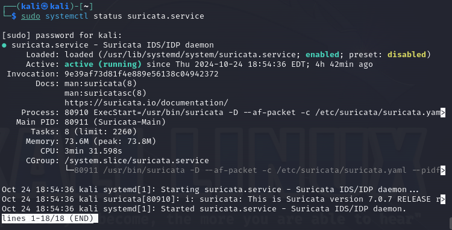
</p>

**View Configuration Files:**
```bash
ls -al /etc/suricata
ls -al /etc/suricata/rules
```

<p align="center">
    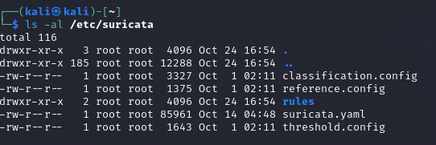
    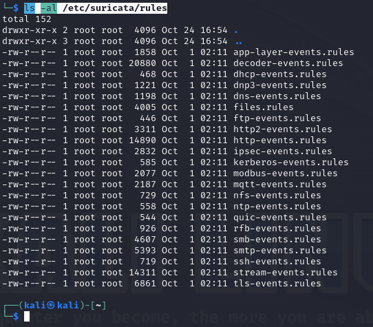
</p>

**Network Interface Configuration:**
```bash
ifconfig
```

<p align="center">
    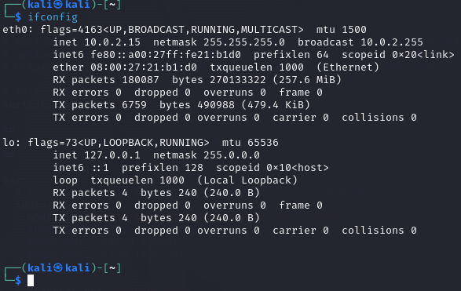
</p>

### Suricata Configuration

**Defining Network Ranges:**
<p align="center">
    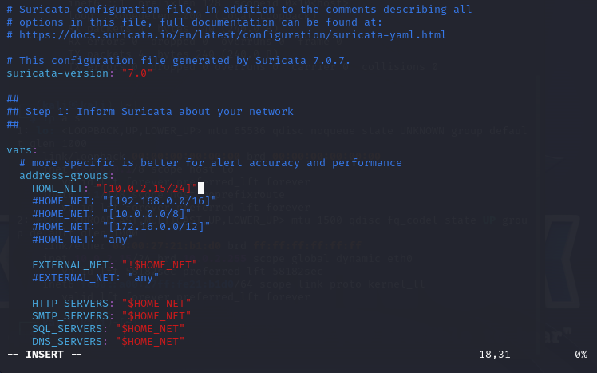
</p>

**Configuring Packet Capture:**
<p align="center">
    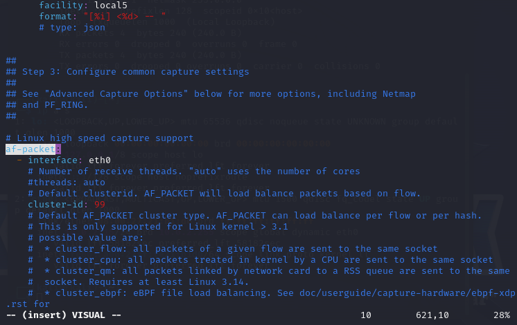
</p>

**Enabling Flow IDs for SIEM Integration:**
<p align="center">
    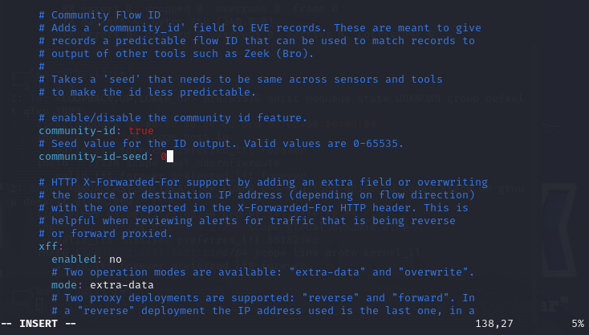
</p>

**Loading Configuration & Rules:**
```bash
sudo suricata -T -c /etc/suricata/suricata.yaml
```

<p align="center">
    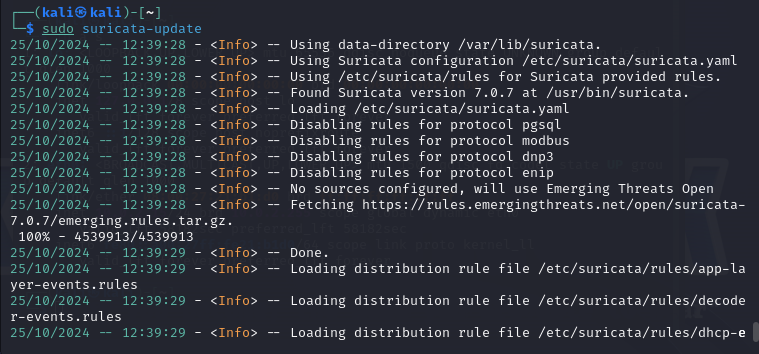
    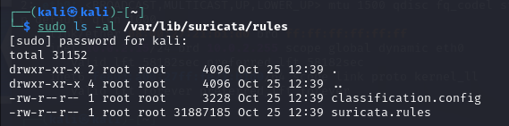
</p>

### Adding Threat Intelligence Sources

| Source | Purpose |
|--------|---------|
| **ET/Open** | Community-driven emerging threat rules |
| **tgreen/hunting** | Advanced threat hunting rules |
| **malsilo/win-malware** | Windows malware detection |

<p align="center">
    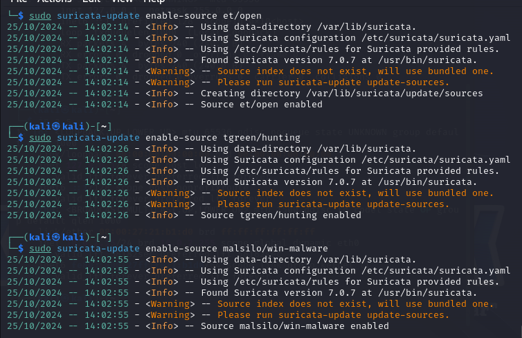
</p>

### Testing Suricata

**Generate Test Traffic:**
```bash
curl http://testmynids.org/uid/index.html
sudo cat /var/log/suricata/fast.log
```

<p align="center">
    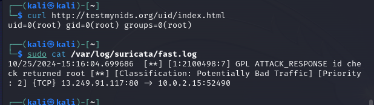
</p>

**Custom ICMP Rule:**
```
alert icmp any any -> $HOME_NET any (msg:"ICMP Ping"; sid:1; rev:1;)
```

<p align="center">
    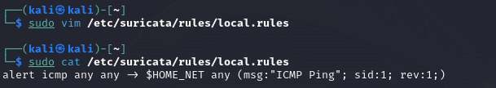
</p>

**ICMP Attack Simulation:**
```bash
ping [Suricata_VM_IP]
```

<p align="center">
    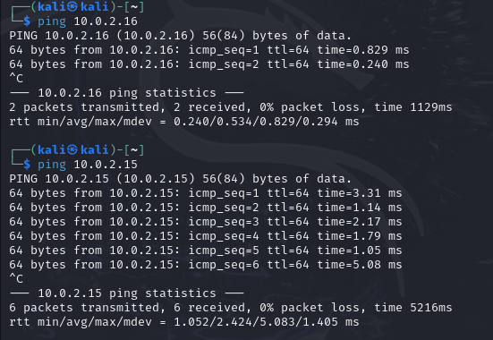
    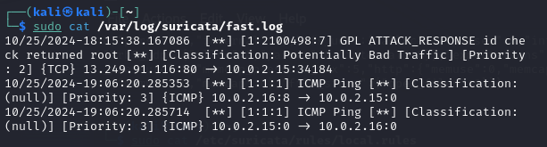
</p>

---

## 📊 Wazuh SIEM Deployment

### What is Wazuh?

Wazuh is an open-source **Security Information and Event Management (SIEM)** platform that:
- Aggregates logs from multiple sources
- Correlates events with detection rules
- Generates alerts with severity levels
- Maps to MITRE ATT&CK framework
- Provides a dashboard for visualization

### Wazuh Architecture

| Component | Function |
|-----------|----------|
| **Wazuh Manager** | Core engine processing data and generating alerts |
| **Wazuh Indexer** | Stores indexed logs for fast retrieval |
| **Wazuh Dashboard** | User interface for visualization and alert management |

<p align="center">
    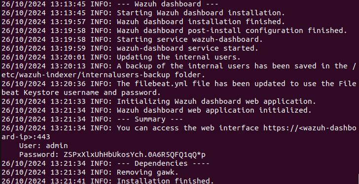
</p>

### Service Validation

**Wazuh Manager:**
```bash
sudo systemctl status wazuh-manager
```

<p align="center">
    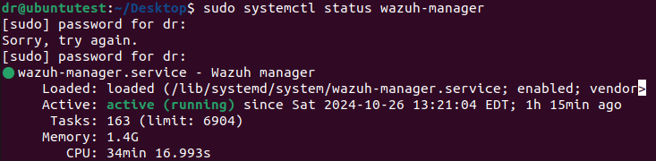
</p>

**Wazuh Indexer:**
```bash
sudo systemctl status wazuh-indexer
```

<p align="center">
    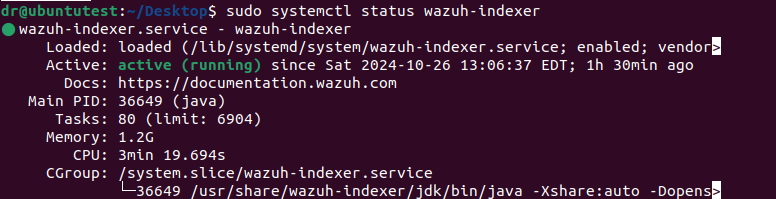
</p>

**Wazuh Dashboard:**
```bash
sudo systemctl status wazuh-dashboard
```

<p align="center">
    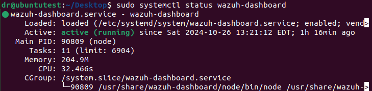
</p>

### Integrating Suricata with Wazuh

**Agent Configuration:**
<p align="center">
    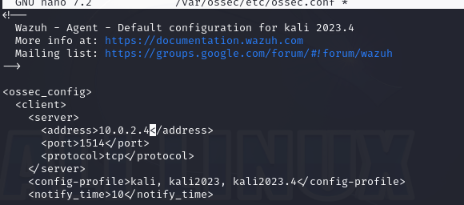
    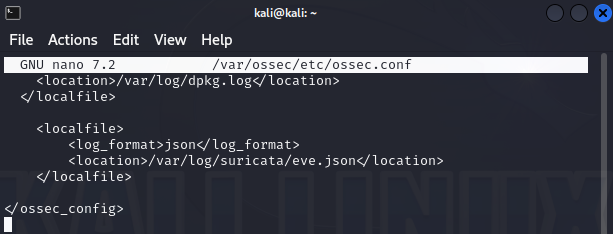
</p>

**Agent Validation:**
<p align="center">
    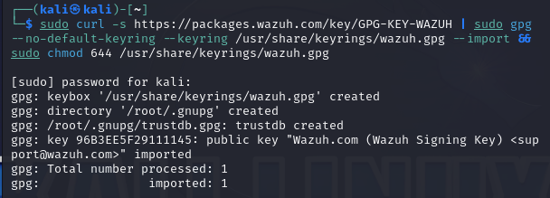
    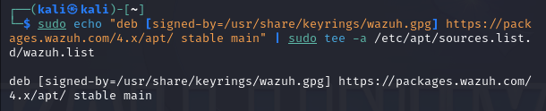
</p>

**Suricata Logs in Dashboard:**
<p align="center">
    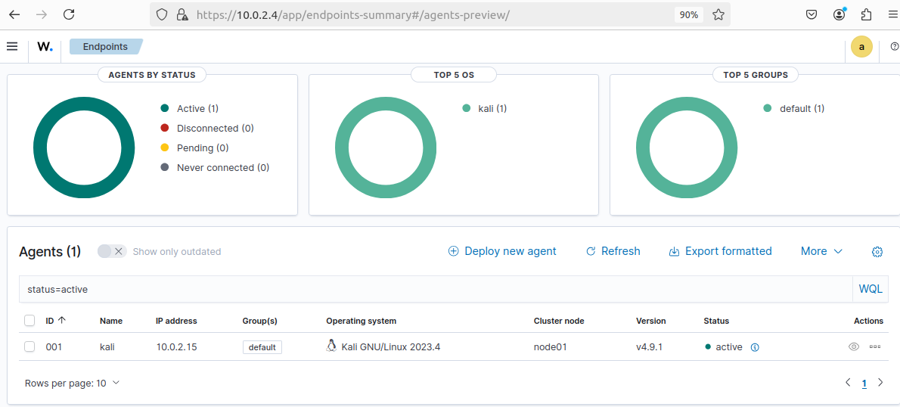
    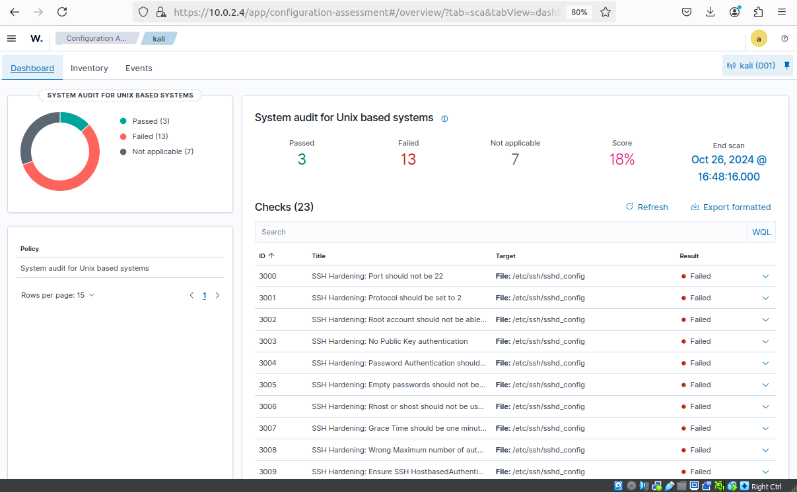
</p>

**ICMP Alert Details:**
<p align="center">
    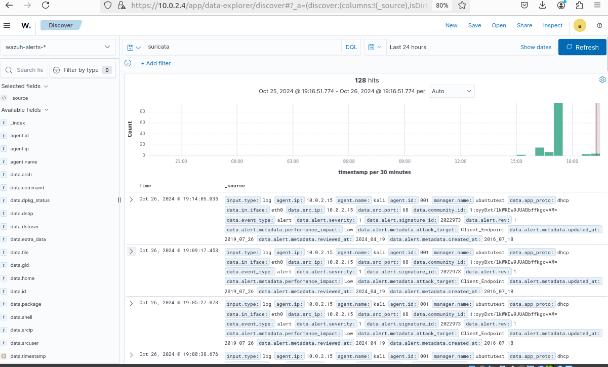
    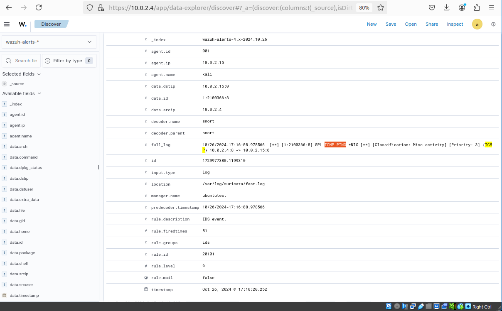
    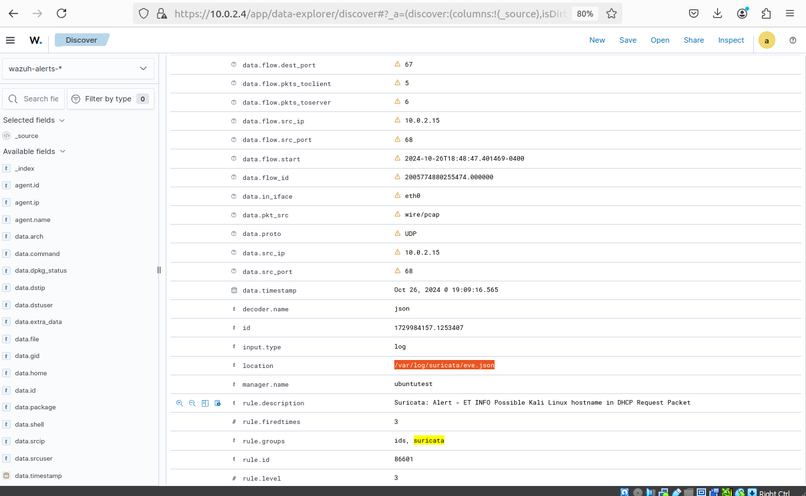
</p>

---

## 🖥️ Sysmon Endpoint Monitoring

### What is Sysmon?

**Sysmon (System Monitor)** is a Windows service that provides deep system telemetry beyond standard Event Logs.

### What Sysmon Adds

| Capability | Windows Event Logs | Sysmon |
|------------|-------------------|--------|
| Process Creation | EventID 4688 | EventID 1 (full command line, hashes) |
| Network Connections | Basic | EventID 3 (source/destination, process) |
| **Process Injection** | ❌ Not detectable | ✅ EventID 10 |
| File Creation | Limited | EventID 11 (full path, hashes) |
| Registry Changes | Generic | EventID 13 (before/after values) |
| DNS Queries | ❌ | ✅ EventID 22 |

### Installation

```powershell
# Create directory and download
New-Item -ItemType Directory -Path "C:\Sysmon" -Force
Invoke-WebRequest -Uri "https://download.sysinternals.com/files/Sysmon.zip" -OutFile "C:\Sysmon\Sysmon.zip"
Expand-Archive -Path "C:\Sysmon\Sysmon.zip" -DestinationPath "C:\Sysmon"

# Install with configuration
C:\Sysmon\Sysmon64.exe -accepteula -i C:\Sysmon\sysmon-config.xml

# Verify
Get-Service Sysmon64
Get-Process -ProcessName Sysmon64
```

### Wazuh Integration

Add this to `C:\Program Files (x86)\ossec-agent\ossec.conf`:

```xml
<localfile>
    <location>Microsoft-Windows-Sysmon/Operational</location>
    <log_format>eventchannel</log_format>
</localfile>
```

---

## ⚔️ Attack Simulation & Detection

### How We Simulated Attacks

Using a Windows endpoint with Sysmon installed, we executed common attacker techniques:

| Attack | Purpose | What It Simulates |
|--------|---------|-------------------|
| Process Injection | Hide malware in legitimate processes | T1055 |
| Encoded PowerShell | Hide malicious commands | T1027 |
| Registry Persistence | Survive system reboots | T1547.001 |
| C2 Communication | Beacon to attacker servers | T1071 |
| User Creation | Backdoor account | T1098 |
| Admin Escalation | Gain full system control | T1484 |

### Attack Results Summary

| Attack Type | Detection Method | Alerts | Severity |
|-------------|------------------|--------|----------|
| **Process Injection** | Sysmon EventID 10 | ~20 | **Level 12** |
| **Encoded PowerShell** | Sysmon EventID 1 | ~5 | **Level 12** |
| Registry Persistence | Sysmon EventID 13 | Multiple | Medium |
| C2 Communication | Sysmon EventID 3 | Multiple | Low-Medium |
| Admin Escalation | Wazuh EventID 4732 | 1 | **Level 12** |

---

## 🚨 Attack Details & Detection

### 1. Process Injection (T1055)

**What Happened:**
```
PowerShell.exe accessed Explorer.exe → possible process injection
```

**Why It's Critical:**
- Attackers inject malicious code into legitimate processes
- Hides malware from antivirus
- Can steal credentials or maintain persistence

**Detection:**
```
Rule ID: 92910 | Severity: Level 12
Source: powershell.exe → Target: explorer.exe
MITRE Tactic: Defense Evasion, Privilege Escalation
```

**Real-World Impact:**
- Mimikatz injects into LSASS.exe to steal passwords
- Cobalt Strike injects beacons into svchost.exe
- Ransomware injects into explorer.exe

### 2. Encoded PowerShell Commands (T1027)

**What Happened:**
```
PowerShell executed Base64 encoded command → obfuscated malicious code
```

**Why It's Critical:**
- Fileless malware - no file written to disk
- Encoded commands bypass basic detection
- Downloads additional payloads from C2 servers

**Detection:**
```
Rule ID: 92057 | Severity: Level 12
Command: powershell -EncodedCommand [Base64 String]
MITRE Tactic: Defense Evasion
```

**Real-World Examples:**
- Emotet uses encoded PowerShell for initial infection
- Ryuk ransomware uses PowerShell for deployment
- APT groups use it for stealthy execution

### 3. Admin Escalation (T1484)

**What Happened:**
```
net localgroup administrators attacker /add → user added to Administrators
```

**Why It's Critical:**
- Full system control granted to unauthorized user
- Complete compromise of the endpoint
- Enables lateral movement across network

**Detection:**
```
EventID: 4732 | Severity: Level 12
User "attacker" added to Administrators group
MITRE Tactic: Privilege Escalation
```

**Attack Chain:**
```
User Creation (T1098) → Admin Escalation (T1484) → 
Persistence (T1547) → Credential Access (T1003) → 
Lateral Movement (T1021)
```

---

## 🎯 MITRE ATT&CK Mapping

| Attack | MITRE ID | Tactic | Technique |
|--------|----------|--------|-----------|
| Process Injection | T1055 | Defense Evasion, Privilege Escalation | Process Injection |
| Encoded PowerShell | T1027 | Defense Evasion | Obfuscated Files or Information |
| Registry Persistence | T1547.001 | Persistence, Privilege Escalation | Registry Run Keys |
| C2 Communication | T1071 | Command and Control | Application Layer Protocol |
| User Creation | T1098 | Persistence | Account Manipulation |
| Admin Escalation | T1484 | Privilege Escalation | Domain Policy Modification |

---

## 🔐 Incident Response Workflow

### When a Level 12 Alert Triggers

```
┌─────────────────────────────────────────────────────────────┐
│ 1. DETECTION                                               │
│    - Alert appears in Wazuh Dashboard                      │
│    - Level 12 severity - immediate attention required      │
│    - 25 alerts generated from attack simulation            │
├─────────────────────────────────────────────────────────────┤
│ 2. TRIAGE                                                  │
│    - Verify if alert is valid (not false positive)         │
│    - Check affected system (DESKTOP-3QDQSU0)              │
│    - Determine potential impact                           │
│    - Escalate to Tier 2 analyst                           │
├─────────────────────────────────────────────────────────────┤
│ 3. INVESTIGATION                                           │
│    - Process injection detected: PowerShell → Explorer    │
│    - Who: User "danie" executed the attack                │
│    - What: Base64 encoded PowerShell command              │
│    - When: June 18, 2026 @ 23:15:21                      │
│    - Search for related events: 4720, 4732, 4698, 7045   │
├─────────────────────────────────────────────────────────────┤
│ 4. CONTAINMENT                                             │
│    - Isolate infected endpoint                            │
│    - Block malicious domains in firewall                  │
│    - Kill suspicious processes                            │
│    - Disable compromised user accounts                    │
├─────────────────────────────────────────────────────────────┤
│ 5. ERADICATION                                             │
│    - Remove unauthorized user "attacker"                  │
│    - Delete malicious registry entries                    │
│    - Remove suspicious services and tasks                 │
│    - Run antivirus scan                                   │
├─────────────────────────────────────────────────────────────┤
│ 6. RECOVERY                                                │
│    - Restore system to known-good state                   │
│    - Reset all passwords                                  │
│    - Verify no persistence remains                        │
├─────────────────────────────────────────────────────────────┤
│ 7. LESSONS LEARNED                                         │
│    - Update detection rules                               │
│    - Enhance monitoring for PowerShell activity           │
│    - User awareness training                              │
│    - Document incident for future reference               │
└─────────────────────────────────────────────────────────────┘
```

---

## 💼 Why This Lab Matters

### The Cybersecurity Skills Gap

This lab demonstrates hands-on experience with:

| Skill | Application |
|-------|-------------|
| **IDS/IPS Configuration** | Deploying Suricata in production |
| **SIEM Implementation** | Building SOC infrastructure |
| **Endpoint Monitoring** | Sysmon for deep visibility |
| **Log Analysis** | Investigating Windows Event Logs |
| **Threat Detection** | Identifying malicious activity |
| **Incident Response** | Following proven workflows |
| **MITRE ATT&CK** | Mapping attacks to techniques |

### Real-World Application

| Lab Skill | Enterprise SOC Use |
|-----------|-------------------|
| Suricata IDS | Network perimeter monitoring |
| Wazuh SIEM | Centralized alert management |
| Sysmon Telemetry | Advanced threat hunting |
| Attack Simulation | Security validation |
| Incident Response | Breach investigation |

### How This Lab Prepares Me

| Before Lab | After Lab |
|------------|-----------|
| Theory only | Hands-on implementation |
| Knew tools existed | Deployed and configured tools |
| Understood alerts | Generated and investigated alerts |
| Knew MITRE ATT&CK | Mapped attacks to MITRE |
| Knew incident response | Followed response workflow |

---

## 🚀 Future Improvements

| Enhancement | Value |
|-------------|-------|
| **Threat Intelligence Feeds** | Better detection of emerging threats |
| **SOAR Integration (TheHive)** | Automated incident response |
| **Additional Endpoints** | Broader visibility |
| **Machine Learning** | Anomaly detection |
| **Compliance Reporting** | Automated compliance checks |
| **Threat Hunting** | Proactive detection |

---

## 📚 Key Takeaways

1. **Defense in Depth Wins**
   - Network (Suricata) + System (Wazuh) + Endpoint (Sysmon)
   - Multiple layers catch what others miss

2. **Visibility is Everything**
   - Sysmon provides visibility standard logs don't
   - Process injection detection only possible with Sysmon
   - Encoded commands revealed through Sysmon

3. **MITRE ATT&CK Provides Context**
   - T1055 (Process Injection) → High severity
   - T1027 (Encoded Commands) → High severity
   - Alerting without context is noise

4. **Attack Simulation Validates Security**
   - You can't detect what you don't test
   - Regular testing improves detection
   - SOC readiness requires practice

5. **Open Source is Enterprise-Ready**
   - Suricata + Wazuh + Sysmon = Complete monitoring
   - Free tools with enterprise capabilities
   - Industry-standard for many organizations

---

## 📖 References

- [Sysmon Documentation](https://learn.microsoft.com/en-us/sysinternals/downloads/sysmon)
- [Wazuh Documentation](https://documentation.wazuh.com/)
- [Suricata Documentation](https://suricata.readthedocs.io/)
- [MITRE ATT&CK](https://attack.mitre.org/)
- [SwiftOnSecurity Sysmon Config](https://github.com/SwiftOnSecurity/sysmon-config)

---

## ✅ Lab Completion Checklist

| Task | Status |
|------|--------|
| ✅ Suricata IDS deployed and configured | ✅ |
| ✅ Custom Suricata rules created | ✅ |
| ✅ Wazuh SIEM installed (Manager, Indexer, Dashboard) | ✅ |
| ✅ Wazuh agent configured on Windows endpoint | ✅ |
| ✅ Suricata integrated with Wazuh | ✅ |
| ✅ Windows auditing enabled | ✅ |
| ✅ Sysmon installed and configured | ✅ |
| ✅ Sysmon integrated with Wazuh | ✅ |
| ✅ Attack simulations performed | ✅ |
| ✅ **25+ high-severity alerts generated** | ✅ |
| ✅ MITRE ATT&CK mapping | ✅ |
| ✅ Incident response runbooks created | ✅ |
| ✅ Screenshots captured | ✅ |

---

**This lab demonstrates enterprise-grade security monitoring using open-source tools, with successful detection of advanced threats including process injection (T1055) and encoded PowerShell commands (T1027).**
